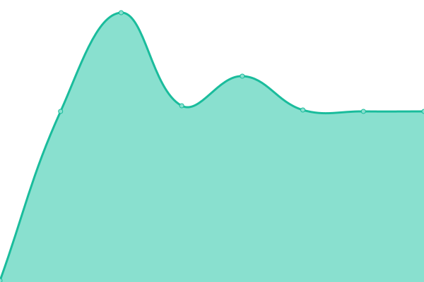
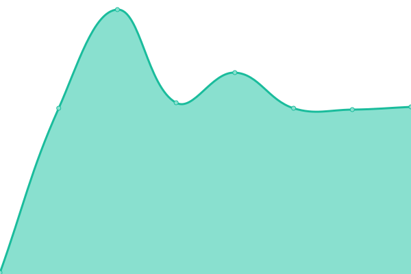

# [📈 Live Status](https://ServeRest.github.io/status-agilizei): <!--live status--> **🟩 All systems operational**

This repository contains the open-source uptime monitor and status page for [ServeRest](http://serverest.dev/), powered by [Upptime](https://github.com/upptime/upptime).

With [Upptime](https://upptime.js.org), you can get your own unlimited and free uptime monitor and status page, powered entirely by a GitHub repository. We use [Issues](https://github.com/ServeRest/status-agilizei/issues) as incident reports, [Actions](https://github.com/ServeRest/status-agilizei/actions) as uptime monitors, and [Pages](https://ServeRest.github.io/status-agilizei) for the status page.

<!--start: status pages-->
<!-- This summary is generated by Upptime (https://github.com/upptime/upptime) -->
<!-- Do not edit this manually, your changes will be overwritten -->
<!-- prettier-ignore -->
| URL | Status | History | Response Time | Uptime |
| --- | ------ | ------- | ------------- | ------ |
|  [api.agilizei.com/](http://serverest-api-agilizei-com.umbler.net/) | 🟩 Up | [api-agilizei-com.yml](https://github.com/ServeRest/status-agilizei/commits/HEAD/history/api-agilizei-com.yml) | 

 733ms
     
 | 

<a href="https://serverest-status.agilizei.com/history/api-agilizei-com">100.00%</a>
    

|  [API /usuarios](http://serverest-api-agilizei-com.umbler.net/usuarios) | 🟩 Up | [api-usuarios.yml](https://github.com/ServeRest/status-agilizei/commits/HEAD/history/api-usuarios.yml) | 

 158ms
     
 | 

<a href="https://serverest-status.agilizei.com/history/api-usuarios">100.00%</a>
    

|  [API /carrinhos](http://serverest-api-agilizei-com.umbler.net/carrinhos) | 🟩 Up | [api-carrinhos.yml](https://github.com/ServeRest/status-agilizei/commits/HEAD/history/api-carrinhos.yml) | 

 141ms
     
 | 

<a href="https://serverest-status.agilizei.com/history/api-carrinhos">100.00%</a>
    

|  [API /produtos](http://serverest-api-agilizei-com.umbler.net/produtos) | 🟩 Up | [api-produtos.yml](https://github.com/ServeRest/status-agilizei/commits/HEAD/history/api-produtos.yml) | 

 135ms
     
 | 

<a href="https://serverest-status.agilizei.com/history/api-produtos">100.00%</a>
    

<!--end: status pages-->

[**Visit our status website →**](https://ServeRest.github.io/status-agilizei)

## 📄 License

- Powered by: [Upptime](https://github.com/upptime/upptime)
- Code: [MIT](./LICENSE) © [ServeRest](http://serverest.dev/)
- Data in the `./history` directory: [Open Database License](https://opendatacommons.org/licenses/odbl/1-0/)
